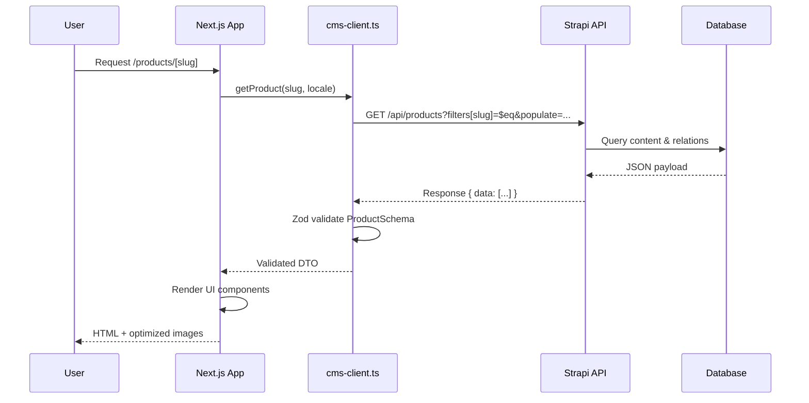

# The Great Beans - Complete Architecture Guide

## 📚 Documentation Index

### Core Architecture Documents
- **INTERNAL-PAGES-IMPLEMENTATION-COMPLETE.md** - Complete implementation guide for all 7 page templates
- **DEEP-TEST-REPORT.md** - Comprehensive test results and code quality report
- **PROJECT-STRUCTURE.md** - Project structure and file organization
- **FINAL-PROJECT-STATUS.md** - Final project status and readiness
- **QUICK-START.md** - Quick setup and development guide
- **README.md** - Project overview and setup instructions
- **CLEANUP-SUMMARY.md** - Project cleanup and file organization summary

### Frontend Documentation
- **frontend/STRAPI-CONTENT-GUIDE.md** - Complete Strapi content population guide (1080 lines)
- **frontend/SEO-GUIDE.md** - SEO best practices and implementation
- **frontend/ACCESSIBILITY-GUIDE.md** - WCAG AA compliance guide
- **frontend/PERFORMANCE-OPTIMIZATION.md** - Performance optimization strategies
- **frontend/SECURITY-AUDIT.md** - Security best practices
- **frontend/LAUNCH-CHECKLIST.md** - Pre-launch checklist
- **frontend/CONTENT-STRATEGY.md** - Content strategy and guidelines
- **frontend/COMPANY-INFO.md** - Company information and brand guidelines
- **frontend/CROSS-BROWSER-TESTING.md** - Browser compatibility guide
- **frontend/README.md** - Frontend setup and development guide

### Backend Documentation
- **backend/README.md** - Backend setup guide
- **backend/SETUP.md** - Strapi setup instructions

## 🏗️ Project Structure

### Frontend (Next.js 14)
```
frontend/
├── src/
│   ├── app/[locale]/          # Internationalized routes
│   │   ├── page.tsx           # Homepage
│   │   ├── about/             # About page
│   │   ├── contact/           # Contact page with form
│   │   ├── products/[slug]/  # Product detail page
│   │   ├── resources/         # Knowledge assets
│   │   │   ├── [slug]/       # Article page
│   │   │   └── category/[slug]/ # Category hub page
│   │   └── services/[slug]/   # Service detail page
│   ├── components/
│   │   ├── shared/            # Reusable components
│   │   ├── sections/          # Homepage sections
│   │   └── ui/                # UI primitives
│   └── lib/
│       ├── cms-client.ts      # Strapi API client
│       ├── validators/        # Zod schemas
│       └── seo/               # SEO utilities
```

### Backend (Strapi 5)
```
backend/
├── src/
│   ├── api/                   # Content types
│   │   ├── product/
│   │   ├── knowledge-asset/
│   │   ├── service/
│   │   ├── category/
│   │   ├── about-page/        # Single type
│   │   └── contact-page/       # Single type
│   └── components/            # Reusable components
│       ├── shared/
│       ├── product/
│       ├── service/
│       ├── about/
│       └── contact/
```

## 🎯 Key Features

### Page Templates (7 Total)
1. **Product Detail** - Tabs, specs table, gallery, related products
2. **Knowledge Asset** - TOC, 2-column layout, social share
3. **Service Detail** - Process timeline, capabilities grid, FAQ
4. **Category/Pillar** - Hub layout with articles grid
5. **About** - Timeline, CEO profile, mission/vision
6. **Contact** - Form with server actions, Google Maps
7. **404** - User-friendly error page

### Shared Components (14)
- Breadcrumbs, FAQSection, RichTextRenderer
- ProductCard, ArticleCard
- ProductTabs, SpecificationsTable, PackagingOptions
- TableOfContents, ContentSectionsRenderer, SocialShare
- ProcessTimeline, CapabilitiesGrid

### SEO Implementation
- JSON-LD schemas for all page types
- Dynamic metadata generation
- BreadcrumbList on all pages
- FAQPage, HowTo, CollectionPage schemas

## 🚀 Quick Start

1. **Install Dependencies**
   ```bash
   cd backend && npm install
   cd ../frontend && npm install
   ```

2. **Start Strapi**
   ```bash
   cd backend && npm run develop
   ```

3. **Start Next.js**
   ```bash
   cd frontend && npm run dev
   ```

4. **Populate Content**
   - Follow `frontend/STRAPI-CONTENT-GUIDE.md`
   - Create content types in Strapi Admin
   - Populate with sample data

## 📝 Testing

Run comprehensive tests:
```bash
cd frontend && node test-comprehensive.js
```

## 🔗 Important Links

- Strapi Admin: http://localhost:1337/admin
- Next.js Dev: http://localhost:3000
- API: http://localhost:1337/api

---

**Last Updated:** Implementation Complete
**Status:** Production Ready

## System Architecture

```mermaid
graph TD
  U[User] --> N[Next.js 14 App Router]
  N --> C[cms-client.ts]
  C -->|HTTPS fetch| S[Strapi 5 API]
  S --> D[(PostgreSQL/SQLite)]
  S --> M[Uploads (public/uploads)]
  N --> I[Next Image Optimization]
  I --> M
  N --> SEO[SEO Utilities]
  subgraph Frontend
    N
    C
    I
    SEO
  end
  subgraph Backend
    S
    D
    M
  end
```

### Runtime Overview
- Next.js renders pages under `frontend/src/app/[locale]/...` and calls `cms-client.ts` for data.
- `cms-client.ts` builds explicit Strapi queries and validates responses with Zod.
- Strapi serves JSON from content types and media from `backend/public/uploads`.
- Environment: `frontend/.env.local` (`NEXT_PUBLIC_API_URL`, `STRAPI_API_TOKEN`), `backend/.env` (DB and secrets).

## Component Interaction Flow



## Data Flow & Models
- Strapi content types define attributes and relations (`backend/src/api/*/content-types/*/schema.json`).
- Example: `product.slug` is a `uid` derived from `name` (backend/src/api/product/content-types/product/schema.json:24-28).
- Frontend queries explicitly populate nested relations and media; see `frontend/src/lib/cms-client.ts` for each entity.
- ISR caching configured per endpoint (homepage 60s at frontend/src/lib/cms-client.ts:184; content ~3600s at 269, 358, 453).

## Key Business Logic
- Explicit populate strategy and mandatory Zod validation (frontend/src/lib/cms-client.ts:11-19, 193-201).
- Locale-aware routing via middleware (frontend/src/middleware.ts:4-39, 65-75).
- Product data contract enforced by Zod (frontend/src/lib/validators/product.ts:35-65).
- Database selection via environment (backend/config/database.ts:7-21).

## Build & Deployment
- Backend: `npm run develop|build|start` (backend/package.json). Config at `backend/config/server.ts` including CORS (server.ts:10-13).
- Frontend: `npm run dev|build|start` (frontend/package.json). Standalone output enabled (frontend/next.config.js:53).
- Env generators: `backend/generate-env.js`, `frontend/generate-env.js` produce minimal `.env` files.
- No Docker/K8s manifests present; deploy Next standalone and Strapi per platform standards.

## Testing & QA
- No test framework configured in `package.json`; referenced scripts are absent.
- Web Vitals monitoring is available via `src/components/performance/WebVitals.tsx`.
- Recommend introducing Jest/Vitest for unit tests and Playwright for E2E.

## CI/CD
- No repository CI detected (`.github/workflows` not present).
- Suggested pipeline: install, lint/type-check, build frontend/backend, run tests, publish artifacts, deploy.

## Performance Characteristics
- Next Image optimization and AVIF/WebP formats (frontend/next.config.js:10-29, 23).
- Bundle analyzer optional via `ANALYZE=true` (frontend/next.config.js:1-3).
- ISR and cache headers; long-term static asset caching (frontend/next.config.js:92-109).
- Compiler removes console in production except warnings/errors (frontend/next.config.js:32-36).

## Security Considerations
- Strapi security and CORS middleware (backend/config/middlewares.ts:1-36).
- Admin and API secrets required in `backend/.env` (`APP_KEYS`, `ADMIN_JWT_SECRET`, `API_TOKEN_SALT`, etc.).
- Next security headers set globally (frontend/next.config.js:55-90).
- Avoid `populate=*` and validate inputs/outputs to reduce attack surface.

## Known Limitations & Technical Debt
- No automated tests in repo despite documentation references.
- No CI/CD pipeline or containerization manifests.
- Public content permissions must be manually configured in Strapi.
- Frontend depends on `STRAPI_API_TOKEN` for protected endpoints; access degrades without it.


